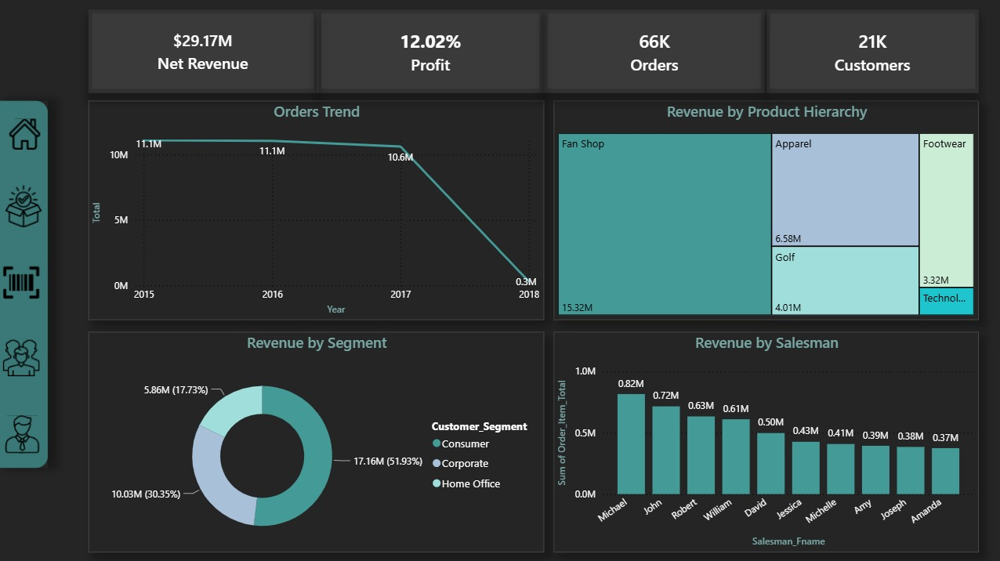
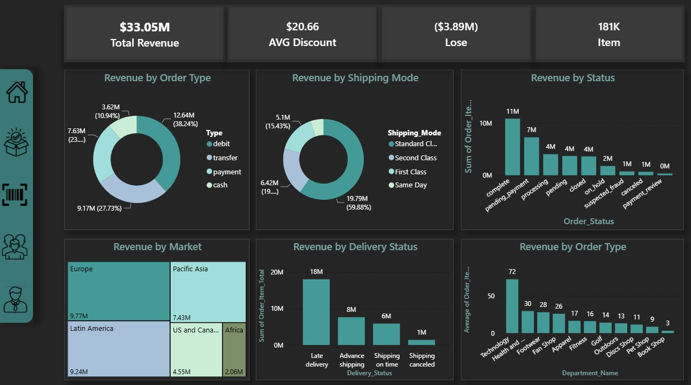
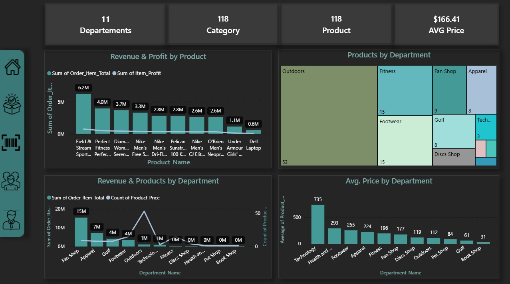
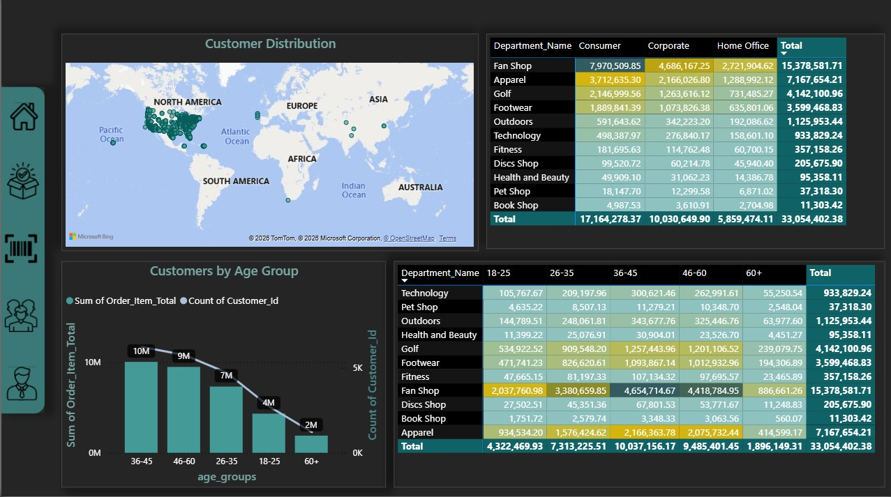
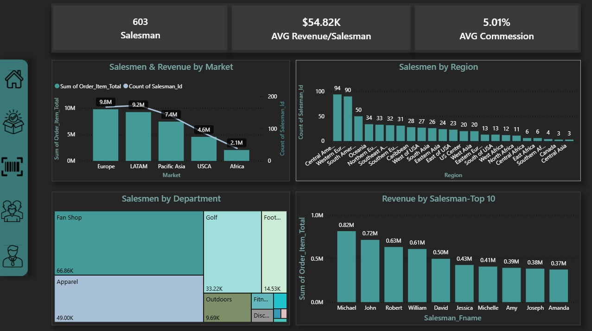

# Supply Chain Analytics | SQL Server & Power BI

## Project Overview

This project presents an end-to-end **Supply Chain Analytics solution** developed using **SQL Server and Power BI**.

The project transforms raw operational data into a structured analytical solution through data quality validation, data cleaning, transformation, dimensional modeling, and interactive dashboard development.

The analysis focuses on understanding **orders, products, customers, sales performance, shipping, delivery, revenue, and profitability** to provide a comprehensive view of supply chain performance.

---

## Business Problem

Supply chain operations generate large amounts of data across different business areas. However, raw operational data alone does not provide the structured insights required for effective decision-making.

The objective of this project was to build an analytical solution capable of answering key business questions such as:

* How is overall revenue and profit performing?
* Which products and departments contribute most to revenue?
* How are orders distributed across different statuses and markets?
* Which customer segments contribute most to revenue?
* How does sales performance vary across salesmen, markets, and regions?
* How do shipping and delivery methods affect order performance?

---

## Data Architecture

The project follows a layered data architecture:

```text
Raw Data
   ↓
Bronze Layer
   ↓
Silver Layer
   ↓
Gold Layer
   ↓
Power BI
   ↓
Business Insights
```

### Bronze Layer

The Bronze layer focuses on the raw data and initial data quality assessment.

Key activities included:

* Checking missing values
* Detecting duplicate records
* Validating categorical values
* Checking record counts
* Validating relationships between related datasets

### Silver Layer

The Silver layer focuses on cleaning and transforming the data into analysis-ready tables.

Key transformations included:

* Handling missing values
* Standardizing categorical values
* Normalizing text fields
* Creating derived columns
* Creating order year and month
* Calculating customer age and age groups
* Calculating item-level profit

### Gold Layer

The Gold layer transforms the cleaned data into a dimensional analytical model.

The model includes:

**Dimension Tables**

* `DimDate`
* `DimCustomers`
* `DimProducts`
* `DimSalesman`

**Fact Table**

* `FactOrders`

Primary and foreign keys were used to establish relationships between the fact and dimension tables and support analytical reporting.

---

## SQL Analysis & Data Preparation

SQL Server was used throughout the data preparation and modeling process.

Key techniques included:

* Data Quality Checks
* NULL Handling
* Duplicate Detection
* Data Standardization
* Data Cleaning
* Data Transformation
* Derived Business Columns
* Referential Integrity Checks
* Primary & Foreign Keys
* Fact & Dimension Modeling
* Star Schema Design

---

## Power BI Dashboard

The final Power BI report consists of five analytical pages designed to provide different perspectives on supply chain performance.

### 1. Executive Overview

Provides a high-level view of overall business performance through:

* Net Revenue
* Profit
* Orders
* Customers
* Revenue Trend
* Revenue by Salesman
* Revenue by Product Hierarchy
* Revenue by Customer Segment

### 2. Order Analysis

Focuses on order and delivery performance through:

* Revenue by Status
* Revenue by Shipping Mode
* Revenue by Order Type
* Average Discount by Department
* Revenue by Market
* Revenue by Delivery Status

### 3. Product Analysis

Analyzes the product portfolio and financial performance through:

* Products by Department
* Revenue & Profit by Product
* Revenue & Products by Department
* Average Price by Department

### 4. Customer Analysis

Provides insights into the customer base through:

* Customer Distribution
* Customers by Age Group
* Revenue by Age Group
* Department Mix by Age
* Department Mix by Customer Segment

### 5. Salesman Analysis

Evaluates sales performance through:

* Salesmen & Revenue by Market
* Revenue by Salesman
* Salesmen by Department
* Salesmen by Region

---

## Dashboard Preview

### Executive Overview



### Order Analysis



### Product Analysis



### Customer Analysis



### Salesman Analysis



---

## Key Insights

The dashboard provides a comprehensive view of supply chain performance across revenue, profitability, orders, products, customers, and sales performance.

Key analytical areas include:

* Revenue and profitability trends
* Order and delivery performance
* Product and department contribution
* Customer segmentation and revenue contribution
* Salesman and regional performance
* Shipping and order-type analysis

---

## Business Recommendations

Based on the analytical framework developed in this project, businesses can use the dashboard to:

* Monitor revenue and profitability performance.
* Identify high-performing products and departments.
* Evaluate order and delivery performance.
* Analyze customer segments and their contribution to revenue.
* Compare sales performance across markets and regions.
* Monitor discount patterns and their potential impact on profitability.
* Support data-driven supply chain and sales decisions.

---

## Tools & Technologies

* **SQL Server**
* **Power BI Desktop**
* **Power Query**
* **DAX**
* **Data Cleaning**
* **Data Transformation**
* **Data Modeling**
* **Dimensional Modeling**
* **Dashboard Design**
* **Business Intelligence**

---

## Repository Structure

```text
Supply-Chain-Analytics/
│
├── SQL/
│   ├── Bronze/
│   ├── Silver/
│   └── Gold/
│
├── PowerBI/
│   └── SupplyChain.pbix
│
├── Dashboard/
│   ├── Overview.jpeg
│   ├── Orders.jpeg
│   ├── Products.jpeg
│   ├── Customer.jpeg
│   └── Salesman.jpeg
│
├── Data/
│   └── data.zip
│
└── README.md
```

---

## Project Workflow

```text
Raw Data
    ↓
Data Quality Assessment
    ↓
Bronze Layer
    ↓
Data Cleaning & Transformation
    ↓
Silver Layer
    ↓
Dimensional Modeling
    ↓
Gold Layer
    ↓
Power BI Data Model
    ↓
Dashboard & Business Insights
```

---

## Conclusion

This project demonstrates an end-to-end approach to transforming raw supply chain data into a structured business intelligence solution.

By combining **SQL-based data preparation and dimensional modeling with Power BI visualization and analysis**, the project provides an interactive view of supply chain performance and supports data-driven business decision-making.

